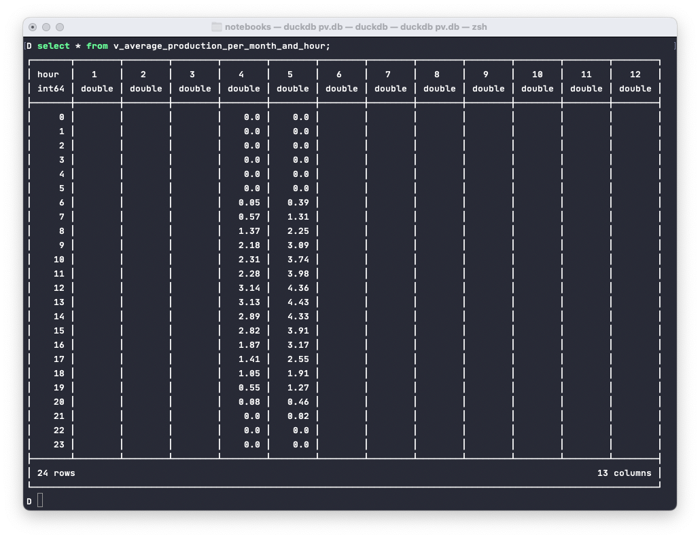

# pv

⚠️ Programs and scripts in this repository are not meant to be used and may damage your equipment.

## Requirements

### For the power logger

The logger is based on the [Energy systems reading toolkit](https://energy.basjes.nl). Thanks a ton for your work, [Niels Basjes](https://mastodon.basjes.nl/@niels). 

Build the power logger with

```bash
mvn -f logger/pom.xml clean package
```

### Using the provided notebook with my latest published data

You need to install the following Python dependencies. I used `pip3` which happened to work on a recent macOS machine:

```bash
pip3 install notebook pandas matplotlib numpy duckdb
jupyter notebook notebooks/pv_at_simons.ac.ipynb
```

This will clear the output from the notebook file:

```bash
jupyter nbconvert --ClearOutputPreprocessor.enabled=True --inplace notebooks/pv_at_simons.ac.ipynb
```

There's also an online version available at [mybinder.org](https://mybinder.org/v2/gh/michael-simons/pv/HEAD?labpath=notebooks%2Fpv_at_simons.ac.ipynb).

### Database

[DuckDB](https://duckdb.org) >= 0.7.1, Java 17 for running `initial_data.java`.

All schema scripts starts with an uppercase `V` followed by an incrementing number.

```bash
find sql -iname "V*__*.sql" -print | sort | xargs cat | duckdb pv.db
```

All statistics work with views. Those are named with an uppercase `R` to indicate that the contained statements are always repeatable:

```bash
find sql -iname "R__*.sql" -and -not -iname "R__*\[requires_nightly\].sql" -print0 |\
  (xargs -r0  cat; echo "SELECT table_catalog, table_name FROM information_schema.tables WHERE table_type = 'VIEW'")|\
  duckdb pv.db
```

Some views require a nightly DuckDB build (>= v0.7.2-dev2706 43a97f9078).

```bash
find sql -iname "R__*\[requires_nightly\].sql" -print0 |\
  (xargs -r0  cat; echo "SELECT table_catalog, table_name FROM information_schema.tables WHERE table_type = 'VIEW'")|\
  duckdb pv.db
```

There is some inventory data present, mostly my installed peak power and Germany's vat history:

```bash
duckdb pv.db < sql/Inventory_data.sql
```

Some statistics will look odd without data for all quarterly hours, and I have created a script that loads initial data:

```bash
java sql/initial_data.java | duckdb pv.db "INSERT INTO production SELECT ts::timestamptz, power FROM read_csv_auto('/dev/stdin') ON CONFLICT (measured_on) DO NOTHING";
```

Values are stored per quarterly hour, as local date times (local timezone is assumed). For dealing with specifics to your area, i.e. changes during summer / winter time observations, scripts needs adjustment. 

`production` looks like this:

```
D show production;
┌─────────────┬──────────────┬─────────┬─────────┬─────────┬───────┐
│ column_name │ column_type  │  null   │   key   │ default │ extra │
│   varchar   │   varchar    │ varchar │ varchar │ varchar │ int32 │
├─────────────┼──────────────┼─────────┼─────────┼─────────┼───────┤
│ measured_on │ TIMESTAMP    │ NO      │ PRI     │         │       │
│ power       │ DECIMAL(8,3) │ NO      │         │         │       │
└─────────────┴──────────────┴─────────┴─────────┴─────────┴───────┘
```

## Usage

### Logger

Run the power logger with

```bash
./logger/target/assembly/bin/log-power-output
```

Again, this might damage your inverter, burn down the house and what not. Use at your own risk.

On macOS, you can use `launchctl` to run this program as a service. See below for logfile rotation.

```bash
launchctl submit -l log-power-output -o `pwd`/logger.csv -- `pwd`/logger/target/log-power-output -a your.address 
```

Remove again with

```bash
launchctl remove log-power-output
```

### Database

#### Import from the loggers output

_Logger puts out 1 minute measurements in watt (W)._

```bash
duckdb pv.db < sql/import_logger.sql
```

#### Import from energymanager.com

_Export is 15 minutes average watt (W)_.

```bash
duckdb pv.db < sql/import_energymanager.sql
```

#### Import from meteocontrol.com daily chart export

_Export is 5 minutes average kilowatt (kW)._

```bash
duckdb pv.db < sql/import_meteocontrol.sql
```

Concatenating several exports into one file via [xsv](https://github.com/BurntSushi/xsv):

```bash
find . -type f -iname "chart*.csv" -print0 | xargs -r0 xsv cat -d ";" rows | xsv fmt -t ";" > meteocontrol.csv
```

#### Purging data

For example:

```sql
DELETE FROM production WHERE date_trunc('day', measured_on) < '2023-04-20' AND false;
```

#### Creating backups

The whole database can be exported either as CSV files like this

```sql
EXPORT DATABASE 'target_folder';
```

Or if you prefer [Parquet](https://parquet.apache.org), use the following:

```sql
EXPORT DATABASE 'target_folder' (FORMAT PARQUET, COMPRESSION ZSTD);
```

#### Statistics

##### Overalls

```bash
duckdb --readonly pv.db "SELECT * FROM overall_production"
```

##### Per Month

```bash
duckdb --readonly pv.db "SELECT * FROM production_per_month"
```

##### Per day

```bash
duckdb --readonly pv.db "SELECT * FROM production_per_day"
```

##### Peaks

```bash
duckdb --readonly pv.db "SELECT * FROM peaks"
```

##### Average per month

```bash
duckdb --readonly pv.db "SELECT * FROM average_production_per_month"
```

Should look something like this, which I totally love:


##### Average per hour

```bash
duckdb --readonly pv.db "SELECT * FROM average_production_per_hour"
```

##### Average per hour and month

```bash
duckdb --readonly pv.db "SELECT * FROM average_production_per_month_and_hour"
```

The `PIVOT` support is fantastic:



## Managing log files

### Using `split`

`split` can be used to split data into files with a given number of lines or chunk-size like that:

```bash
./logger/target/log-power-output -a your.address | split -d -l4690 - logger.csv.
```

If needed they can be aggregated into one file like this

```bash
find . -type f -iname "logger.csv.*" -print0 | xargs -r0 cat | sort > logger.csv
```

### Using `logrotate`

There's a template configuration file for `logrotate` that might be helpful. Assuming you are logging like this:

```bash
./logger/target/log-power-output -a your.address >> logger.csv
```

you can rotate everything with this command

```bash
logrotate -f  etc/logrotate.conf 
```
